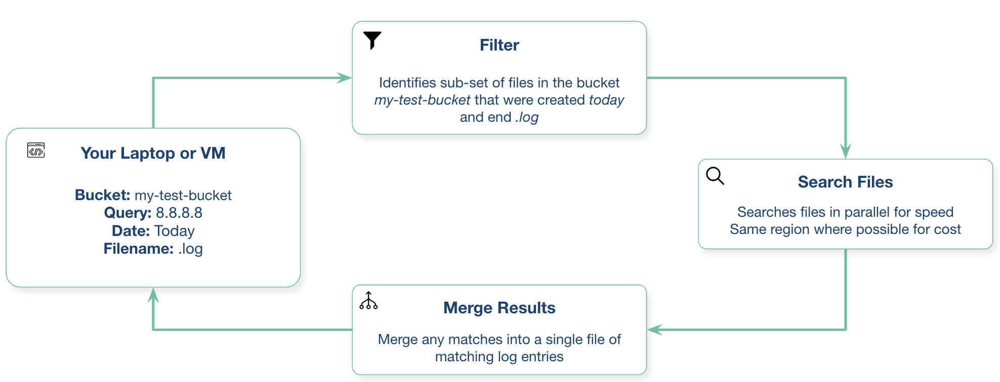

# cloudgrep #
cloudgrep searches cloud storage.


It currently supports searching log files, optionally compressed with gzip (.gz) or zip (.zip), in AWS S3.



### Why? ###
- Directly searching cloud storage, without indexing logs into a SIEM or Log Analysis tool, can be faster and cheaper.
- There is no need to wait for logs to be ingested, indexed, and made available for searching.
- It searches files in parallel for speed.
- If you run this in the same region as the S3 bucket using a [VPC endpoint for S3](https://awsmadeeasy.com/blog/aws-s3-vpc-endpoint-transfer-cost-reduction/) you can avoid data transfer costs. Do check first!
- This may be of use when debugging applications, or investigating a security incident.

### Example ###

Simple example:
```
python3 cloudgrep.py --bucket test-s3-access-logs --query 9RXXKPREHHTFQD77
python3 cloudgrep.py -b test-s3-access-logs -q 9RXXKPREHHTFQD77
```

More complicated example:
```
python3 cloudgrep.py -b test-s3-access-logs --prefix "logs/" --filename ".log" -q 9RXXKPREHHTFQD77 -s "2023-01-09 20:30:00" -e "2023-01-09 20:45:00" --file_size 10000 --debug
```

Saving the output to a file:
```
python3 cloudgrep.py -b test-s3-access-logs -q 9RXXKPREHHTFQD77 --hide_filenames > output.txt
```

Example output:
```
Bucket is in region: us-east-2 : Search from the same region to avoid egress charges.
Searching 11 files in test-s3-access-logs for 9RXXKPREHHTFQD77...
access2023-01-09-20-34-20-EAC533CB93B4ACBE: abbd82b5ad5dc5d024cd1841d19c0cf2fd7472c47a1501ececde37fe91adc510 bucket-72561-s3bucketalt-1my9piwesfim7 [09/Jan/2023:19:20:00 +0000] 1.125.222.333 arn:aws:sts::000011110470:assumed-role/bucket-72561-myResponseRole-1WP2IOKDV7B4Y/1673265251.340187 9RXXKPREHHTFQD77 REST.GET.BUCKET - "GET /?list-type=2&prefix=-collector%2Fproject-&start-after=&encoding-type=url HTTP/1.1" 200 - 946 - 33 32 "-" "Boto3/1.21.24 Python/3.9.2 Linux/5.10.0-10-cloud-amd64 Botocore/1.24.46" - aNPuHKw== SigV4 ECDHE-RSA-AES128-GCM-SHA256 AuthHeader bucket-72561-s3bucketalt-1my9piwesfim7.s3.us-east-2.amazonaws.com TLSv1.2 - -
```

### Arguments ###
```
python3 cloudgrep.py --help
usage: cloudgrep.py [-h] -b BUCKET -q QUERY [-p PREFIX] [-f FILENAME] [-s START_DATE] [-e END_DATE] [-fs FILE_SIZE] [-d] [-hf]

CloudGrep searches is grep for cloud storage like S3.

options:
  -h, --help            show this help message and exit
  -b BUCKET, --bucket BUCKET
                        Bucket to search. E.g. my-bucket
  -q QUERY, --query QUERY
                        Text to search for. Will be parsed as a Regex. E.g. example.com
  -p PREFIX, --prefix PREFIX
                        Optionally filter on the start of the Object name. E.g. logs/
  -f FILENAME, --filename FILENAME
                        Optionally filter on Objects that match a keyword. E.g. .log.gz
  -s START_DATE, --start_date START_DATE
                        Optionally filter on Objects modified after a Date or Time. E.g. 2022-01-01
  -e END_DATE, --end_date END_DATE
                        Optionally filter on Objects modified before a Date or Time. E.g. 2022-01-01
  -fs FILE_SIZE, --file_size FILE_SIZE
                        Optionally filter on Objects smaller than a file size, in bytes. Defaults to 100 Mb.
  -d, --debug           Enable Debug logging.
  -hf, --hide_filenames
                        Dont show matching filesnames.
```

### Deployment ###

Install with:
``` pip3 install -r requirements.txt ```

You can run this from your local laptop, or from an EC2 instance in the same region as the S3 bucket with a [VPC endpoint for S3](https://aws.amazon.com/blogs/architecture/overview-of-data-transfer-costs-for-common-architectures/) to avoid egress charges.
You can authenticate in a [number of ways](https://docs.aws.amazon.com/cli/latest/userguide/cli-chap-configure.html).
If you are running on an EC2, an [Instance Profile](https://devopscube.com/aws-iam-role-instance-profile/) is likely the best choice.

### Contributions ###
We welcome any contributions to this project! Please add via a Pull Request.

Possible future work could include:
- Support for Azure and Google Cloud
- Support for zstd compression
- Log parsing and detection using grok patterns
- Export parsed logs in a standard syslog format

### Help ###
Please open a GitHub issue if you have any questions or suggestions.
This is not an officially supported Cado Security product.
